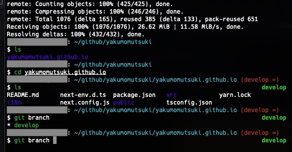

# Setup for Mac

Macのセットアップ方針です

# Browser

Macで導入するブラウザ一覧です

- Firefox (default)
- Google Chrome
- Safari

※ Firefox は WebGL まわりで google meet の背景ぼかしが使えないため、google meet 利用時は Chrome を使用すること

# Tools

Macで導入するツール一覧です

|  便利ツール系  |  機能  |
| ---- | ---- |
|  [Clipy](https://clipy.softonic.jp/mac)  |  クリップボード履歴  |
|  [HyperSwitch](https://bahoom.com/hyperswitch)  |  `cmd + tab` でウィンドウの切り替えをする  |


|  開発ツール系  |  機能  |
| ---- | ---- |
|  [VS Code](https://azure.microsoft.com/ja-jp/products/visual-studio-code/)  |  高機能コードエディタ  |
|  [Homebrew](https://brew.sh/index_ja)  |  パッケージ管理  |
|  Docker  |  仮想環境/コンテナ  |
|  [Volta](https://volta.sh/)  |  JavaScript Tool Manager  |

## VS Code

- [Mac の日本語入力ソース選択に Ctrl + Space を取られて Eclipse のコンテンツ・アシストが効かなかったときのメモ](https://ebc-2in2crc.hatenablog.jp/entry/2017/10/11/221202)
- [IntelliJ IDEA Keybindings](https://marketplace.visualstudio.com/items?itemName=k--kato.intellij-idea-keybindings)

VS Codeのキーマップは Intellij IDEA に変更してあります。

## Docker

```bash
brew install --cask docker; # Dockerのインストール
open /Applications/Docker.app; # Docker for Mac および docker-compose コマンドが入る
```

## Volta

公式を引用、Homebrew 経由で入れるとちょい厄介なので必ず以下の手順から😥

```bash
# install Volta
curl https://get.volta.sh | bash

# install Node
volta install node

# start using Node
node
```

## Fonts

- https://github.com/miiton/Cica/releases より最新版の package を取得する
- package を展開して作成された該当のフォルダを `~/ライブラリ/Fonts/` に移動させる

## Terminal

テーマ変更

- [bashからZshに乗り換え - preztoを使ってプロンプトテーマを変えてみた](https://qiita.com/gilly/items/5ff7bd7142e963cdbb9b)
- ただし thema の変更はせず、`sorin` を使用します

Git の補完機能追加

- [ZshでのGitのコマンド補完をもっと便利にする on Linux](https://zenn.dev/aruneko/articles/26815f95ea2124)

Fonts 変更

- `Cica(シカ)` をデフォルトに設定



